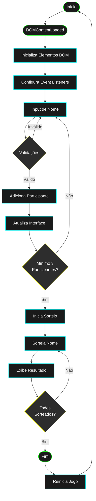

# 🧬💥 Amigo Secreto - *Cyberpunk Edition* 💥🧬

> Uma experiência futurista para um clássico jogo de fim de ano.

  

---

## 🧠 Visão Geral

Esta é uma **aplicação web interativa** para realizar sorteios de *Amigo Secreto* com uma estética **Cyberpunk** vibrante. Com ela, é possível adicionar participantes, realizar sorteios de forma aleatória e acompanhar tudo por meio de uma interface imersiva com **efeitos visuais, responsividade e uma experiência temática completa**.

---

## 🚀 Funcionalidades

### ✅ Adição de Participantes

* Campo intuitivo para digitar nomes
* Validação contra entradas vazias e nomes duplicados
* Bloqueio de novas entradas após o início do sorteio

### 📋 Lista Dinâmica

* Atualização em tempo real
* Nomes sorteados recebem marcação visual (riscado + selo “✓ SORTEADO”)

### 🎲 Sorteio Aleatório

* Requer mínimo de 3 participantes para iniciar
* Escolha aleatória entre os não sorteados
* Nome em destaque no painel com animação cyberpunk
* Sistema de ocultação de resultados
* Sem repetições na mesma rodada

### 🧩 Gerenciamento de Estado

* Mensagens dinâmicas e adaptativas:
  * "Adicione mais amigos para começar!" (menos de 3 participantes)
  * "Clique em Sortear para começar!" (3 ou mais participantes)
  * Contagem regressiva de sorteios restantes
* Botões com estados inteligentes (ativado/desativado conforme contexto)
* Sistema de notificações para feedback

### 🔄 Reinício Seguro

* Modal de confirmação antes do reinício
* Limpeza completa do jogo
* Reset de todos os estados e animações
* Pronto para uma nova rodada futurista

---

## 🛠️ Tecnologias Utilizadas

| Linguagem             | Finalidade                                                 |
| --------------------- | ---------------------------------------------------------- |
| **HTML5**             | Estrutura semântica da aplicação                           |
| **CSS3**              | Visual Cyberpunk com responsividade e animações            |
| **JavaScript (ES6+)** | Lógica do sorteio, manipulação do DOM e controle de estado |

---

## 💡 Como Usar

1. **Clone o repositório**

```bash
git clone https://github.com/DessimA/amigo-secreto.git
cd amigo-secreto
```

2. **Abra no navegador**
   Simplesmente abra o arquivo `index.html`. Nenhuma instalação adicional é necessária.

3. **Adicione nomes**
   Digite o nome → Clique em “Adicionar” ou pressione `Enter`.

4. **Inicie o sorteio**
   Clique em “Sortear Amigo” para revelar o próximo nome.

5. **Reinicie quando desejar**
   Clique em “Reiniciar” para começar tudo de novo com uma nova galera!

---

### 🔧 Estrutura Base do Código

#### Variáveis Globais
```javascript
let amigos = [];           // Array que armazena todos os participantes
let amigosSorteados = []; // Array que armazena participantes já sorteados
let jogoIniciado = false; // Controla o estado do jogo
```

### 🎯 Principais Funcionalidades

#### 1. Inicialização (`DOMContentLoaded`)
- Carrega todos os elementos do DOM necessários
- Configura eventos dos botões e modal
- Inicializa o estado do jogo

#### 2. Adição de Participantes (`adicionarAmigo()`)
1. Valida se o jogo já foi iniciado
2. Remove espaços em branco do nome
3. Verifica se o nome está vazio
4. Normaliza o nome para verificar duplicatas
5. Adiciona o participante se todas as validações passarem
6. Atualiza a interface

#### 3. Sistema de Sorteio (`sortearAmigo()`)
1. Verifica se há mínimo de 3 participantes
2. Marca o jogo como iniciado
3. Filtra participantes ainda não sorteados
4. Realiza sorteio aleatório
5. Atualiza a interface com animações

#### 4. Gerenciamento de Estado
- `atualizarControles()`: Gerencia estado dos botões
- `atualizarStatus()`: Atualiza mensagens de status
- `atualizarListaAmigos()`: Atualiza lista visual de participantes

#### 5. Sistema de Notificações
```javascript
function exibirNotificacao(msg) {
    notificacaoDiv.textContent = msg;
    notificacaoDiv.style.display = 'block';
}
```

### 🔄 Fluxo de Dados

1. **Entrada de Dados**
   - Input de texto para nomes
   - Validações em tempo real
   - Eventos de teclado (Enter) e clique

2. **Processamento**
   - Arrays para armazenamento (`amigos` e `amigosSorteados`)
   - Lógica de sorteio com `Math.random()`
   - Verificações de estado do jogo

3. **Saída**
   - Atualização da lista de participantes
   - Feedback visual (notificações)
   - Animações e efeitos visuais

### 📊 Diagrama de Fluxo



### 🛡️ Sistema de Validações

1. **Validação de Nome**
   - Não permite nomes vazios
   - Não permite nomes duplicados
   - Normaliza maiúsculas/minúsculas

2. **Validação de Estado**
   - Mínimo de 3 participantes para sorteio
   - Bloqueio de adições após início
   - Controle de sorteios restantes

### 🎨 Manipulação Visual

1. **Classes Dinâmicas**
   ```javascript
   li.classList.add('sorteado');     // Marca participante sorteado
   nomeSpan.classList.add('oculto'); // Oculta nome após sorteio
   ```

2. **Elementos Visuais**
   - GIF animado para participantes sorteados
   - Botões com estados visuais
   - Modal de confirmação

### 🔑 Dicas para Iniciantes

1. **Variáveis Globais**
   - São declaradas no topo do arquivo
   - Mantêm o estado do jogo
   - Evite modificá-las diretamente

2. **Funções Principais**
   - Cada função tem uma responsabilidade única
   - Nomes descritivos indicam o propósito
   - Comentários explicam a lógica

3. **Event Listeners**
   - Aguardam o DOM carregar completamente
   - Respondem a interações do usuário
   - Mantêm o código organizado

4. **Boas Práticas**
   - Uso de constantes para mensagens
   - Funções pequenas e focadas
   - Validações preventivas
   - Feedback constante ao usuário

---

## 🗂️ Estrutura do Projeto

```
.
├── assets/
│   ├── amigo-secreto.png        # Background temático
│   ├── hide-cyberpunk.gif       # Animação para participantes sorteados
│   ├── play-game.png            # Ícone do botão sortear
│   └── reload-game.png          # Ícone do botão reiniciar
├── app.js                       # Lógica principal (JS)
├── index.html                   # Estrutura da página
├── README.md                    # Este arquivo
└── style.css                    # Estilo cyberpunk visual
```

---

## 🧬 Estética Cyberpunk

### 🎨 Paleta de Cores

* Fundo escuro (preto, cinza grafite)
* Acentos neon: **ciano elétrico**, **magenta vibrante**, **amarelo ácido**

### 🅰️ Tipografia

* **Orbitron** (monospace digital): títulos e botões
* **Rajdhani** (sans-serif): corpo do texto, fluidez e legibilidade

### ✨ Efeitos Visuais

* Gradientes e blur com `backdrop-filter`
* Brilhos neon, sombras dinâmicas
* Ícones estilizados futuristas
* Animações suaves nos botões

### 📱 Responsivo

* Compatível com telas pequenas e grandes
* Interface adaptável para uso em dispositivos móveis

### 🌐 Disponível em:
> Vercel: https://amigo-secreto-phi-cyan.vercel.app/

> Github Pages: https://dessima.github.io/amigo-secreto/
---
## 📄 Licença

Este projeto está licenciado sob a [MIT License](LICENSE). Sinta-se livre para usar, modificar e compartilhar.

